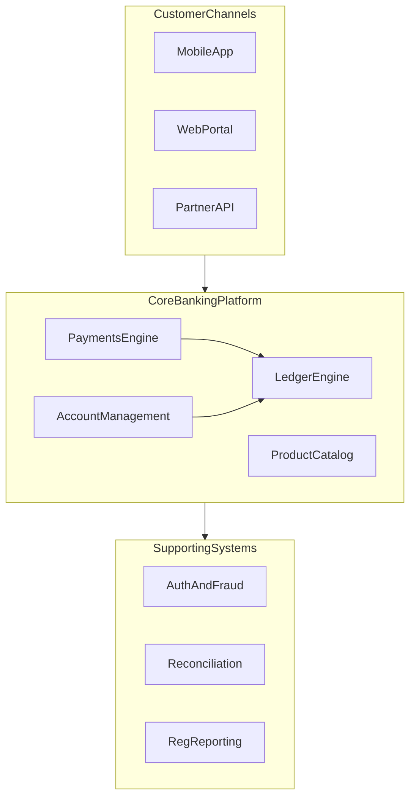
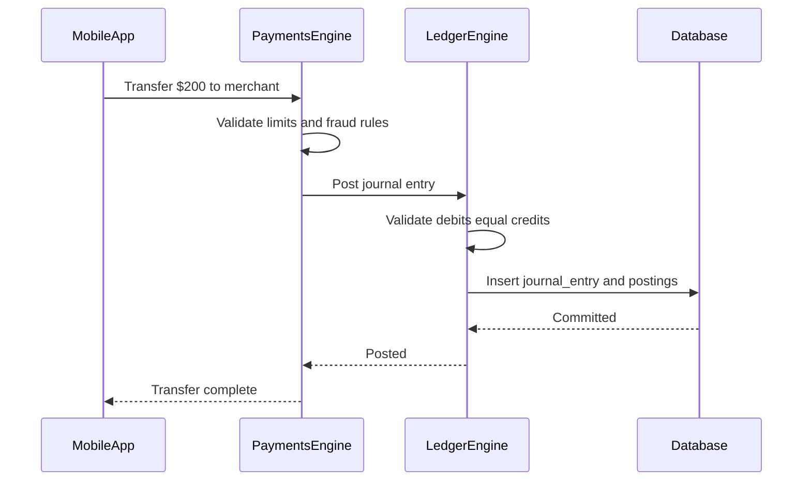
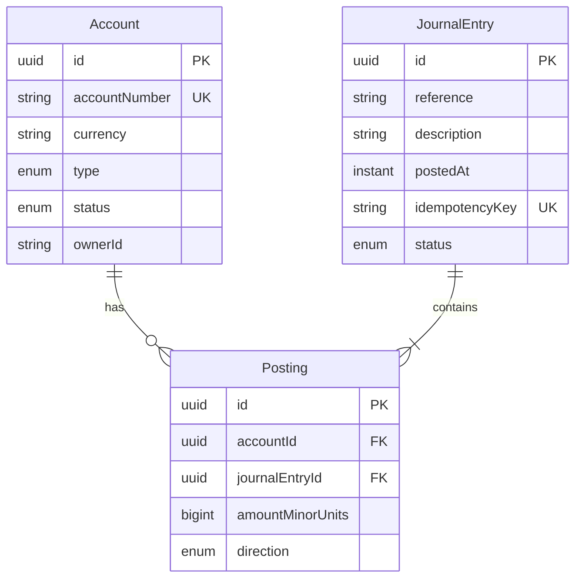

# Building a Ledger System in Spring Boot

A practical guide to understanding **core banking** and implementing a **double-entry ledger** with Spring Boot. Written for fintech engineers who work with money APIs but want to understand what happens under the hood.

---

## Table of Contents

1. [Introduction](#introduction)
2. [How Core Banking Works](#how-core-banking-works)
3. [Double-Entry Bookkeeping](#double-entry-bookkeeping)
4. [Ledger Patterns: Relational vs Event-Sourced](#ledger-patterns-relational-vs-event-sourced)
5. [Domain Model](#domain-model)
6. [Spring Boot Architecture](#spring-boot-architecture)
7. [Step-by-Step Build Guide](#step-by-step-build-guide)
8. [Production Concerns](#production-concerns)
9. [Testing Strategy](#testing-strategy)
10. [Local Development Setup](#local-development-setup)
11. [Roadmap](#roadmap)
12. [References](#references)

---

## Introduction

### What is a ledger system?

In banking and fintech, a **ledger** is the authoritative record of every financial movement. When a customer deposits money, pays a bill, or receives a refund, the ledger records *what moved, from where, to where, and when*.

The ledger is not just a balance column you update with `balance = balance + amount`. That approach loses audit history, breaks under concurrency, and fails regulatory scrutiny. Instead, production systems record **immutable journal entries** — append-only records that can be replayed, audited, and reconciled.

### What this guide covers

| In scope | Out of scope (production core banking adds these) |
|----------|---------------------------------------------------|
| Double-entry ledger fundamentals | KYC / identity verification |
| Core banking module overview | Card network integrations (Visa, Mastercard) |
| Spring Boot project structure | SWIFT / wire messaging |
| REST API design for postings | AML transaction monitoring |
| Idempotency, immutability, reversals | Regulatory reporting (Basel, IFRS) |
| PostgreSQL schema and migrations | PCI-DSS card data handling |

### Prerequisites

- **Java 21+** (this project is configured for JDK 25 in IntelliJ)
- **Maven** or Gradle
- **PostgreSQL 15+**
- Familiarity with Spring Boot, REST APIs, and SQL
- Basic understanding of HTTP and transactional systems

---

## How Core Banking Works

**Core banking** is the central platform that holds customer accounts and processes financial transactions. Every mobile banking app, payment gateway, and partner API ultimately talks to a core banking system (or a ledger service that acts as one).

### High-level architecture



### Core modules explained

| Module | Role | Example |
|--------|------|---------|
| **Account management** | Creates and manages customer accounts, statuses, and metadata | Open a savings account, freeze an account under fraud review |
| **Ledger engine** | Records all financial movements as immutable journal entries | Post a $500 debit when customer withdraws cash |
| **Payments engine** | Initiates and tracks outbound/inbound payments | Send an ACH transfer, receive a wire from another bank |
| **Product catalog** | Defines account types, interest rates, fees, and rules | Savings account earns 4.5% APY; overdraft fee is $35 |
| **Reconciliation** | Matches internal records against external statements | Compare your ledger to the nostro account statement from JPMorgan |

### The golden rule

> **The ledger is append-only.** You never delete or edit a posting. If a mistake is made, you post a **reversing entry** that negates the original. This preserves a complete audit trail.

### How a payment flows through core banking



1. Customer initiates a transfer via the mobile app.
2. The payments engine validates limits, fraud rules, and account status.
3. The ledger engine creates a balanced journal entry (debit one account, credit another).
4. Postings are persisted atomically in a database transaction.
5. Balances are derived from the sum of postings (or maintained as projections).

---

## Double-Entry Bookkeeping

Every financial event affects at least two accounts. Total debits must equal total credits — this is the foundation of accounting and the reason ledgers are auditable.

### Account types

| Type | Normal balance | Banking example |
|------|---------------|-----------------|
| **Asset** | Debit | Bank's cash reserves, loans receivable |
| **Liability** | Credit | Customer deposits (the bank owes this money to customers) |
| **Equity** | Credit | Shareholder capital |
| **Revenue** | Credit | Interest income, fee income |
| **Expense** | Debit | Operating costs, interest paid to depositors |

### Debit and credit rules

| Account type | Debit effect | Credit effect |
|-------------|-------------|---------------|
| Asset | Increases | Decreases |
| Liability | Decreases | Increases |
| Equity | Decreases | Increases |
| Revenue | Decreases | Increases |
| Expense | Increases | Decreases |

### Worked example: customer deposits $1,000 cash

When a customer walks into a branch and deposits $1,000:

- The bank's **cash** (asset) increases → **Debit** Cash $1,000
- The bank's obligation to the customer (liability) increases → **Credit** Customer Deposit $1,000

| Account | Type | Direction | Amount |
|---------|------|-----------|--------|
| Cash (1000) | Asset | DEBIT | $1,000.00 |
| Customer Deposit (2001) | Liability | CREDIT | $1,000.00 |

**Trial balance check:** Total debits ($1,000) = Total credits ($1,000). Entry is balanced.

### Worked example: customer transfers $200 to another customer

| Account | Type | Direction | Amount |
|---------|------|-----------|--------|
| Customer A Deposit (2001) | Liability | DEBIT | $200.00 |
| Customer B Deposit (2002) | Liability | CREDIT | $200.00 |

Customer A's balance decreases (debit a liability), Customer B's balance increases (credit a liability). No cash moves — this is an internal book transfer.

### Worked example: bank charges a $5 fee

| Account | Type | Direction | Amount |
|---------|------|-----------|--------|
| Customer Deposit (2001) | Liability | DEBIT | $5.00 |
| Fee Revenue (4001) | Revenue | CREDIT | $5.00 |

### Why double-entry matters in fintech

- **Auditability** — regulators and auditors can trace every penny.
- **Trial balance** — at any point, sum of all debits equals sum of all credits across the system.
- **Error detection** — an unbalanced entry cannot be posted.
- **Reconciliation** — external statements can be matched against internal postings.

---

## Ledger Patterns: Relational vs Event-Sourced

There are two common ways to implement a ledger. This guide focuses on the **relational double-entry model**, but you should know both.

### Pattern 1: Relational double-entry (recommended for learning)

```
accounts → journal_entries → postings
```

- **Accounts** hold metadata (owner, currency, type, status).
- **Journal entries** group related postings into a single atomic transaction.
- **Postings** are the individual debit/credit lines.

**Best for:** Core banking, traditional banks, systems that need SQL reporting and trial balance queries.

### Pattern 2: Event-sourced ledger

```
events (append-only) → balance projections
```

- Every state change is an immutable event (`AccountCredited`, `AccountDebited`).
- Balances are computed by replaying events or maintained as materialized projections.
- The event log *is* the source of truth.

**Best for:** High-throughput fintech (neobanks, payment processors), systems needing full replay and temporal queries.

### When to use which

| Criteria | Relational double-entry | Event-sourced |
|----------|------------------------|---------------|
| Learning curve | Lower | Higher |
| SQL reporting | Native | Requires projections |
| Audit trail | Journal entries + postings | Full event replay |
| Throughput | Good (with proper indexing) | Excellent (append-only writes) |
| Industry adoption | Traditional core banking | Modern fintech (Modulr, Form3) |

This guide implements **relational double-entry** because it maps directly to how accountants and regulators think about money.

---

## Domain Model

### Entity relationship diagram



### Core business rules

1. **Amounts in minor units** — Store money as `long` integers (cents, pence, kobo). Never use `float` or `double`.
   - $10.50 → `1050` (minor units)
   - ₦1,500.00 → `150000` (kobo)

2. **Balanced entries** — Every journal entry must satisfy: `sum(DEBIT amounts) == sum(CREDIT amounts)` per currency.

3. **Idempotency** — Every write operation carries an `idempotencyKey`. Duplicate keys return the original result without re-posting.

4. **Immutability** — Postings are never updated or deleted. Corrections use reversing entries.

5. **Status lifecycle** — `PENDING` → `POSTED` → `REVERSED` (optional).

### Database schema (Flyway migration)

```sql
-- V1__create_ledger_schema.sql

CREATE TYPE account_type AS ENUM ('ASSET', 'LIABILITY', 'EQUITY', 'REVENUE', 'EXPENSE');
CREATE TYPE account_status AS ENUM ('ACTIVE', 'FROZEN', 'CLOSED');
CREATE TYPE posting_direction AS ENUM ('DEBIT', 'CREDIT');
CREATE TYPE entry_status AS ENUM ('PENDING', 'POSTED', 'REVERSED');

CREATE TABLE accounts (
    id              UUID PRIMARY KEY DEFAULT gen_random_uuid(),
    account_number  VARCHAR(34) NOT NULL UNIQUE,
    currency        CHAR(3) NOT NULL,
    type            account_type NOT NULL,
    status          account_status NOT NULL DEFAULT 'ACTIVE',
    owner_id        VARCHAR(255),
    created_at      TIMESTAMPTZ NOT NULL DEFAULT now(),
    updated_at      TIMESTAMPTZ NOT NULL DEFAULT now()
);

CREATE TABLE journal_entries (
    id               UUID PRIMARY KEY DEFAULT gen_random_uuid(),
    reference        VARCHAR(255) NOT NULL,
    description      TEXT,
    idempotency_key  VARCHAR(255) NOT NULL UNIQUE,
    status           entry_status NOT NULL DEFAULT 'POSTED',
    posted_at        TIMESTAMPTZ NOT NULL DEFAULT now(),
    created_at       TIMESTAMPTZ NOT NULL DEFAULT now()
);

CREATE TABLE postings (
    id                  UUID PRIMARY KEY DEFAULT gen_random_uuid(),
    journal_entry_id    UUID NOT NULL REFERENCES journal_entries(id),
    account_id          UUID NOT NULL REFERENCES accounts(id),
    amount_minor_units  BIGINT NOT NULL CHECK (amount_minor_units > 0),
    direction           posting_direction NOT NULL,
    created_at          TIMESTAMPTZ NOT NULL DEFAULT now()
);

CREATE INDEX idx_postings_account_id ON postings(account_id);
CREATE INDEX idx_postings_journal_entry_id ON postings(journal_entry_id);
CREATE INDEX idx_journal_entries_posted_at ON journal_entries(posted_at);
```

### Balance calculation

A customer's **available balance** is derived from their postings:

```sql
SELECT
    a.account_number,
    a.currency,
    COALESCE(SUM(
        CASE
            WHEN p.direction = 'CREDIT' THEN p.amount_minor_units
            WHEN p.direction = 'DEBIT'  THEN -p.amount_minor_units
        END
    ), 0) AS balance_minor_units
FROM accounts a
LEFT JOIN postings p ON p.account_id = a.id
LEFT JOIN journal_entries je ON je.id = p.journal_entry_id
WHERE a.id = :accountId
  AND je.status = 'POSTED'
GROUP BY a.id, a.account_number, a.currency;
```

For liability accounts (customer deposits), a **credit** increases the balance and a **debit** decreases it. The SQL above works because we store the signed effect directly. In production, you may also maintain a `balance_snapshots` table for read performance.

---

## Spring Boot Architecture

### Project structure

```
src/main/java/com/example/ledger/
├── LedgerApplication.java
├── domain/
│   ├── Account.java
│   ├── JournalEntry.java
│   ├── Posting.java
│   ├── AccountType.java
│   ├── AccountStatus.java
│   ├── PostingDirection.java
│   └── EntryStatus.java
├── repository/
│   ├── AccountRepository.java
│   ├── JournalEntryRepository.java
│   └── PostingRepository.java
├── service/
│   ├── LedgerService.java
│   └── BalanceService.java
├── api/
│   ├── JournalEntryController.java
│   ├── AccountController.java
│   └── dto/
│       ├── CreateJournalEntryRequest.java
│       ├── PostingRequest.java
│       ├── JournalEntryResponse.java
│       └── BalanceResponse.java
├── exception/
│   ├── UnbalancedEntryException.java
│   ├── AccountNotFoundException.java
│   ├── DuplicateIdempotencyKeyException.java
│   └── GlobalExceptionHandler.java
└── config/
    └── JpaConfig.java
```

### Key dependencies (`pom.xml`)

```xml
<dependencies>
    <dependency>
        <groupId>org.springframework.boot</groupId>
        <artifactId>spring-boot-starter-web</artifactId>
    </dependency>
    <dependency>
        <groupId>org.springframework.boot</groupId>
        <artifactId>spring-boot-starter-data-jpa</artifactId>
    </dependency>
    <dependency>
        <groupId>org.springframework.boot</groupId>
        <artifactId>spring-boot-starter-validation</artifactId>
    </dependency>
    <dependency>
        <groupId>org.postgresql</groupId>
        <artifactId>postgresql</artifactId>
        <scope>runtime</scope>
    </dependency>
    <dependency>
        <groupId>org.flywaydb</groupId>
        <artifactId>flyway-core</artifactId>
    </dependency>
    <dependency>
        <groupId>org.flywaydb</groupId>
        <artifactId>flyway-database-postgresql</artifactId>
    </dependency>
    <dependency>
        <groupId>org.springframework.boot</groupId>
        <artifactId>spring-boot-starter-test</artifactId>
        <scope>test</scope>
    </dependency>
    <dependency>
        <groupId>org.testcontainers</groupId>
        <artifactId>postgresql</artifactId>
        <scope>test</scope>
    </dependency>
</dependencies>
```

### Core service logic

The heart of the system is `LedgerService.post()`:

```java
@Service
@RequiredArgsConstructor
public class LedgerService {

    private final JournalEntryRepository journalEntryRepository;
    private final PostingRepository postingRepository;
    private final AccountRepository accountRepository;

    @Transactional
    public JournalEntry post(CreateJournalEntryRequest request) {
        // 1. Idempotency check
        var existing = journalEntryRepository.findByIdempotencyKey(request.idempotencyKey());
        if (existing.isPresent()) {
            return existing.get();
        }

        // 2. Validate all accounts exist and are active
        var accountIds = request.postings().stream()
            .map(PostingRequest::accountId)
            .collect(Collectors.toSet());
        var accounts = accountRepository.findAllById(accountIds);
        if (accounts.size() != accountIds.size()) {
            throw new AccountNotFoundException("One or more accounts not found");
        }
        accounts.forEach(a -> {
            if (a.getStatus() != AccountStatus.ACTIVE) {
                throw new IllegalStateException("Account " + a.getAccountNumber() + " is not active");
            }
        });

        // 3. Validate balanced entry per currency
        validateBalanced(request.postings(), accounts);

        // 4. Persist journal entry and postings
        var entry = JournalEntry.builder()
            .reference(request.reference())
            .description(request.description())
            .idempotencyKey(request.idempotencyKey())
            .status(EntryStatus.POSTED)
            .postedAt(Instant.now())
            .build();
        journalEntryRepository.save(entry);

        var postings = request.postings().stream()
            .map(p -> Posting.builder()
                .journalEntry(entry)
                .accountId(p.accountId())
                .amountMinorUnits(p.amountMinorUnits())
                .direction(p.direction())
                .build())
            .toList();
        postingRepository.saveAll(postings);

        return entry;
    }

    private void validateBalanced(List<PostingRequest> postings, List<Account> accounts) {
        var currencyByAccount = accounts.stream()
            .collect(Collectors.toMap(Account::getId, Account::getCurrency));

        var netByCurrency = new HashMap<String, Long>();
        for (var posting : postings) {
            var currency = currencyByAccount.get(posting.accountId());
            var sign = posting.direction() == PostingDirection.DEBIT ? 1L : -1L;
            netByCurrency.merge(currency, sign * posting.amountMinorUnits(), Long::sum);
        }

        netByCurrency.forEach((currency, net) -> {
            if (net != 0) {
                throw new UnbalancedEntryException(
                    "Entry unbalanced for " + currency + ": net=" + net);
            }
        });
    }
}
```

---

## Step-by-Step Build Guide

### Step 1: Generate the Spring Boot project

Go to [start.spring.io](https://start.spring.io) with these settings:

- **Project:** Maven
- **Language:** Java
- **Spring Boot:** 3.4.x
- **Java:** 21
- **Dependencies:** Spring Web, Spring Data JPA, Validation, PostgreSQL Driver, Flyway Migration

Or create the project manually in this repository.

### Step 2: Configure PostgreSQL

Create `src/main/resources/application.yml`:

```yaml
spring:
  application:
    name: ledger-system
  datasource:
    url: jdbc:postgresql://localhost:5432/ledger
    username: ledger
    password: ledger
  jpa:
    hibernate:
      ddl-auto: validate
    open-in-view: false
    properties:
      hibernate:
        jdbc:
          time_zone: UTC
  flyway:
    enabled: true
    locations: classpath:db/migration

server:
  port: 8080
```

### Step 3: Create database migrations

Place the SQL from the [Domain Model](#database-schema-flyway-migration) section in:

```
src/main/resources/db/migration/V1__create_ledger_schema.sql
```

Add seed data for development:

```sql
-- V2__seed_dev_accounts.sql

INSERT INTO accounts (id, account_number, currency, type, status, owner_id) VALUES
    ('a0000000-0000-0000-0000-000000000001', 'CASH-001',       'USD', 'ASSET',     'ACTIVE', 'bank'),
    ('a0000000-0000-0000-0000-000000000002', 'DEP-ALICE-001',  'USD', 'LIABILITY', 'ACTIVE', 'alice'),
    ('a0000000-0000-0000-0000-000000000003', 'DEP-BOB-001',    'USD', 'LIABILITY', 'ACTIVE', 'bob'),
    ('a0000000-0000-0000-0000-000000000004', 'REV-FEES-001',   'USD', 'REVENUE',   'ACTIVE', 'bank');
```

### Step 4: Implement domain entities

Create JPA entities matching the schema. Key points:

- Use `@Enumerated(EnumType.STRING)` for all enums.
- `JournalEntry` has a `@OneToMany` to `Posting`.
- `Posting.amountMinorUnits` is `Long`, never `BigDecimal` or `double`.
- Add `@Version` on `Account` if you implement optimistic locking.

### Step 5: Implement services

- `LedgerService` — posts journal entries (see [Core service logic](#core-service-logic)).
- `BalanceService` — computes balance from postings or reads from a snapshot table.

### Step 6: Expose the REST API

| Method | Endpoint | Description |
|--------|----------|-------------|
| `POST` | `/api/v1/journal-entries` | Post a balanced journal entry |
| `GET` | `/api/v1/accounts/{id}/balance` | Get current account balance |
| `GET` | `/api/v1/accounts/{id}/postings` | List posting history |
| `GET` | `/api/v1/accounts` | List accounts |
| `POST` | `/api/v1/accounts` | Create a new account |

### Step 7: Add idempotency

Accept an `Idempotency-Key` header on `POST /api/v1/journal-entries`. Store it as a unique constraint on `journal_entries.idempotency_key`. On duplicate:

- Return `200 OK` with the original entry (idempotent retry).
- Do **not** create a second posting.

### Step 8: Run and test

```bash
# Start PostgreSQL (see Local Development Setup below)
docker compose up -d

# Run the application
./mvnw spring-boot:run
```

#### Example: Alice deposits $1,000

```bash
curl -X POST http://localhost:8080/api/v1/journal-entries \
  -H "Content-Type: application/json" \
  -H "Idempotency-Key: deposit-alice-001" \
  -d '{
    "reference": "DEP-2026-001",
    "description": "Cash deposit - Alice",
    "postings": [
      {
        "accountId": "a0000000-0000-0000-0000-000000000001",
        "amountMinorUnits": 100000,
        "direction": "DEBIT"
      },
      {
        "accountId": "a0000000-0000-0000-0000-000000000002",
        "amountMinorUnits": 100000,
        "direction": "CREDIT"
      }
    ]
  }'
```

#### Example: Alice transfers $200 to Bob

```bash
curl -X POST http://localhost:8080/api/v1/journal-entries \
  -H "Content-Type: application/json" \
  -H "Idempotency-Key: transfer-alice-bob-001" \
  -d '{
    "reference": "TRF-2026-001",
    "description": "Transfer from Alice to Bob",
    "postings": [
      {
        "accountId": "a0000000-0000-0000-0000-000000000002",
        "amountMinorUnits": 20000,
        "direction": "DEBIT"
      },
      {
        "accountId": "a0000000-0000-0000-0000-000000000003",
        "amountMinorUnits": 20000,
        "direction": "CREDIT"
      }
    ]
  }'
```

#### Example: Check Alice's balance

```bash
curl http://localhost:8080/api/v1/accounts/a0000000-0000-0000-0000-000000000002/balance
```

Expected response:

```json
{
  "accountId": "a0000000-0000-0000-0000-000000000002",
  "accountNumber": "DEP-ALICE-001",
  "currency": "USD",
  "balanceMinorUnits": 80000,
  "balanceFormatted": "800.00"
}
```

#### Example: Reverse a transfer (correction)

To reverse the $200 transfer, post the opposite entry:

```bash
curl -X POST http://localhost:8080/api/v1/journal-entries \
  -H "Content-Type: application/json" \
  -H "Idempotency-Key: reversal-trf-2026-001" \
  -d '{
    "reference": "REV-TRF-2026-001",
    "description": "Reversal of TRF-2026-001",
    "postings": [
      {
        "accountId": "a0000000-0000-0000-0000-000000000002",
        "amountMinorUnits": 20000,
        "direction": "CREDIT"
      },
      {
        "accountId": "a0000000-0000-0000-0000-000000000003",
        "amountMinorUnits": 20000,
        "direction": "DEBIT"
      }
    ]
  }'
```

---

## Production Concerns

Building a tutorial ledger is straightforward. Running one in production — where real money moves — requires handling these concerns.

### Immutability and audit trail

- Postings are **insert-only**. No `UPDATE` or `DELETE` on financial records.
- Every journal entry records `postedAt`, `reference`, and `description`.
- In production, add `createdBy` (user or system ID) and `correlationId` (link to the originating payment).
- Database backups and point-in-time recovery are mandatory.

### Idempotency

Payment networks retry on timeout. Without idempotency, a retried $500 transfer becomes $1,000.

- Require `Idempotency-Key` on every write endpoint.
- Store keys with a unique constraint.
- Return the original response on duplicate keys.
- Keys should be client-generated UUIDs or deterministic hashes of the business event.

### Concurrency

Two simultaneous withdrawals from the same account can overdraw if you only check balance in application code.

Mitigations (pick one or combine):

- **Pessimistic locking** — `SELECT ... FOR UPDATE` on the account row inside the transaction.
- **Optimistic locking** — `@Version` column on Account; retry on `OptimisticLockException`.
- **Serializable isolation** — PostgreSQL `SERIALIZABLE` for the posting transaction.
- **Balance reservations** — authorize (hold) then capture (post), covered in the roadmap.

### Reconciliation

Daily, your ledger must match external reality:

- **Nostro accounts** — your bank's account at a correspondent bank.
- **Card settlements** — Visa/Mastercard clearing files.
- **Payment rails** — ACH return files, wire confirmations.

Unmatched items go into a **suspense account** until resolved.

### Multi-currency

- Each account has exactly one currency.
- Cross-currency transfers require **two journal entries** (or a single entry with four postings): debit source account, credit FX position, debit FX position, credit destination account.
- Never silently convert currencies — FX rate must be explicit and auditable.

### Reversals vs. refunds

| Operation | Mechanism | When |
|-----------|-----------|------|
| **Reversal** | Compensating journal entry that negates the original | Operator error, failed settlement |
| **Refund** | New journal entry crediting the customer | Customer-initiated return |

Neither operation deletes the original posting.

### Regulatory context

This guide does not implement compliance features, but production systems adjacent to the ledger typically include:

- **AML** — transaction monitoring for suspicious patterns.
- **KYC** — identity verification before account opening.
- **PCI-DSS** — card data security (if handling card numbers).
- **Audit logging** — immutable log of who accessed or changed account metadata.

---

## Testing Strategy

### Unit tests

Test the business logic without a database:

```java
@Test
void shouldRejectUnbalancedEntry() {
    var request = new CreateJournalEntryRequest(
        "ref-001", "unbalanced", "key-001",
        List.of(
            new PostingRequest(accountA, 10000L, DEBIT),
            new PostingRequest(accountB, 5000L, CREDIT)  // unbalanced!
        )
    );

    assertThatThrownBy(() -> ledgerService.post(request))
        .isInstanceOf(UnbalancedEntryException.class);
}
```

### Integration tests with Testcontainers

```java
@SpringBootTest
@Testcontainers
class LedgerIntegrationTest {

    @Container
    static PostgreSQLContainer<?> postgres = new PostgreSQLContainer<>("postgres:16");

    @DynamicPropertySource
    static void configureProperties(DynamicPropertyRegistry registry) {
        registry.add("spring.datasource.url", postgres::getJdbcUrl);
        registry.add("spring.datasource.username", postgres::getUsername);
        registry.add("spring.datasource.password", postgres::getPassword);
    }

    @Test
    void shouldPostEntryAndComputeBalance() {
        // Post deposit
        var entry = ledgerService.post(depositRequest("key-001", 100000L));
        assertThat(entry.getStatus()).isEqualTo(EntryStatus.POSTED);

        // Verify balance
        var balance = balanceService.getBalance(aliceAccountId);
        assertThat(balance).isEqualTo(100000L);

        // Post reversal
        ledgerService.post(reversalRequest("key-002", 100000L));

        // Balance should be zero
        assertThat(balanceService.getBalance(aliceAccountId)).isEqualTo(0L);
    }
}
```

### Trial balance verification

Run after every test suite to confirm the system is balanced:

```sql
SELECT
    a.currency,
    SUM(CASE WHEN p.direction = 'DEBIT'  THEN p.amount_minor_units ELSE 0 END) AS total_debits,
    SUM(CASE WHEN p.direction = 'CREDIT' THEN p.amount_minor_units ELSE 0 END) AS total_credits
FROM postings p
JOIN accounts a ON a.id = p.account_id
JOIN journal_entries je ON je.id = p.journal_entry_id
WHERE je.status = 'POSTED'
GROUP BY a.currency;
```

Total debits must equal total credits for every currency.

---

## Local Development Setup

### Docker Compose for PostgreSQL

Create `docker-compose.yml` in the project root:

```yaml
services:
  postgres:
    image: postgres:16
    ports:
      - "5432:5432"
    environment:
      POSTGRES_DB: ledger
      POSTGRES_USER: ledger
      POSTGRES_PASSWORD: ledger
    volumes:
      - ledger_data:/var/lib/postgresql/data

volumes:
  ledger_data:
```

Start the database:

```bash
docker compose up -d
```

### Environment variables (optional override)

| Variable | Default | Description |
|----------|---------|-------------|
| `SPRING_DATASOURCE_URL` | `jdbc:postgresql://localhost:5432/ledger` | Database URL |
| `SPRING_DATASOURCE_USERNAME` | `ledger` | Database user |
| `SPRING_DATASOURCE_PASSWORD` | `ledger` | Database password |
| `SERVER_PORT` | `8080` | Application port |

### Verify everything works

```bash
# 1. Start database
docker compose up -d

# 2. Run application
./mvnw spring-boot:run

# 3. Post a deposit (see curl examples above)

# 4. Check trial balance
docker compose exec postgres psql -U ledger -d ledger -c "
  SELECT
    SUM(CASE WHEN direction = 'DEBIT'  THEN amount_minor_units ELSE 0 END) AS debits,
    SUM(CASE WHEN direction = 'CREDIT' THEN amount_minor_units ELSE 0 END) AS credits
  FROM postings;
"
```

---

## Roadmap

Once the basic ledger is working, extend it in this order:

1. **Account opening** — `POST /api/v1/accounts` with owner metadata and KYC status hooks.
2. **Internal transfers** — dedicated endpoint that validates sufficient balance before posting.
3. **Holds and reservations** — authorize (reduce available balance) then capture (post to ledger) or release.
4. **End-of-day processing** — daily trial balance report, statement generation, interest accrual.
5. **Balance snapshots** — materialized balance table updated on each posting for fast reads.
6. **Multi-currency FX** — explicit FX conversion entries with rate tracking.
7. **Event-sourced refactor** — migrate to append-only events with balance projections for scale.
8. **Reconciliation module** — import external statements and match against internal postings.

---

## References

### Core banking and accounting

- [Martin Fowler — Accounting Patterns](https://martinfowler.com/eaaDev/AccountingNarrative.html) — how enterprise patterns map to accounting
- [Wikipedia — Double-entry bookkeeping](https://en.wikipedia.org/wiki/Double-entry_bookkeeping) — foundational concepts
- [Banking 101 — How a bank works](https://www.bankingcircle.com/banking-101/) — core banking overview

### Spring Boot and Java

- [Spring Boot Reference Documentation](https://docs.spring.io/spring-boot/reference/index.html)
- [Spring Data JPA](https://docs.spring.io/spring-data/jpa/reference/html/)
- [Flyway Migrations](https://documentation.red-gate.com/fd)

### Fintech engineering

- [Form3 — Building a payment platform](https://www.form3.tech/) — event-driven payment architecture
- [Adyen — Designing a ledger](https://www.adyen.com/) — how payment companies think about ledgers
- [PostgreSQL — Numeric types](https://www.postgresql.org/docs/current/datatype-numeric.html) — why integers beat floats for money

### Money handling

- [Martin Fowler — Money pattern](https://martinfowler.com/eaaCatalog/money.html) — domain-driven design for monetary values
- Always store amounts as integers in minor units. Display formatting is a presentation concern, not a storage concern.

---

## License

This guide is provided for educational purposes. Adapt and use it as a starting point for your own ledger system.
